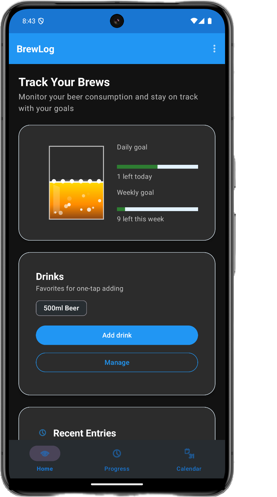

# BrewLog

A simple, private beer consumption tracker for Android.

- Set daily/weekly goals in drinks (based on your default drink size)
- See a fun Beer Glass that fills as you log drinks
- One‑tap Quick Add and a dedicated Drinks manager to add or edit presets
- Initial Setup button on first launch to set goals and baseline quickly
- Calendar view to track, view, and edit past days
- Configurable end‑of‑day cut‑off (default 3 AM)
- Export/import your data to JSON; Delete All Data from settings
- Progress screen shows Today/This Week and reduction vs. baseline
- Native Rust + SQLite backend via JNI for on‑device storage
- Works fully offline. No account, no cloud, no analytics, no ads

### Privacy & Security
BrewLog is privacy‑focused by design:
- No account or sign‑in
- No dangerous/runtime permissions requested (no contacts, location, camera, mic)
- Network‑free by default: the app does not make any internet requests
- All data stays on your device; nothing is uploaded or shared
- No analytics, trackers, ads, or third‑party SDKs
- Works completely offline; no cloud services are required

Your data, your control:
- Entries live in the app’s private storage; uninstalling the app or clearing its data removes everything
- Open‑source codebase — audit how data is handled
- Battery‑friendly: no background sync, polling, or push connections

## Quick Start

1) Install the app
- Download `BrewLog-debug.apk` and install on your phone
- You may need to enable “Install unknown apps” in Android settings

2) First‑time setup
- Open the app → menu ▸ Set Goals & Baseline
- Pick your default drink size (e.g., 500 ml)
- Enter your Daily Goal (in drinks). Weekly auto‑fills as 7× daily

3) Add a drink
- Tap a Quick Add chip, or tap the Beer Glass to repeat the last drink
- The Beer Glass shows daily progress (e.g., “2 / 5 drinks”)

4) View Progress
- Bottom navigation ▸ Progress
- See Today and This Week in drinks, plus reduction vs. baseline

### Screenshots



---

## Developer Guide

### Requirements
- JDK 17+
- Android Studio (SDK + NDK + CMake)
- Rust toolchain
- cargo‑ndk (`cargo install cargo-ndk`)

### One‑command build
From the repository root:
```bash
./build.sh              # builds Rust with cargo‑ndk, builds the APK, copies it to ./BrewLog-debug.apk
PRUNE=1 ./build.sh      # optional: also cargo clean + prune stale jniLibs
```
Notes:
- The script prefers cargo‑ndk; if absent it falls back to plain cargo (requires NDK toolchains on PATH)
- Output APK: `BrewLog-debug.apk` at the repo root

### Manual build (if you prefer)
```bash
# macOS defaults
export ANDROID_SDK_ROOT="$HOME/Library/Android/sdk"
export ANDROID_NDK_HOME="$ANDROID_SDK_ROOT/ndk/26.1.10909125"
# add toolchains bin to PATH (use aarch64 or x86_64 prebuilt dir, depending on host)
if [ -d "$ANDROID_NDK_HOME/toolchains/llvm/prebuilt/darwin-aarch64/bin" ]; then
  export PATH="$ANDROID_NDK_HOME/toolchains/llvm/prebuilt/darwin-aarch64/bin:$PATH"
else
  export PATH="$ANDROID_NDK_HOME/toolchains/llvm/prebuilt/darwin-x86_64/bin:$PATH"
fi

# Build Rust core into jniLibs
cd rust
cargo ndk -t arm64-v8a -o ../android/app/src/main/jniLibs build --release

# Build Android app
cd ../android
./gradlew assembleDebug
```

### Release build
```bash
cd android
./gradlew assembleRelease
open app/build/outputs/apk/release
```
(The output name is configured in the module’s `build.gradle`.)

### Project Structure
```
brewlog/
├── android/                    # Android app (Kotlin)
│   ├── app/src/main/java/com/brewlog/android/
│   │   ├── MainActivity.kt     # Home + Beer Glass + Quick Add
│   │   ├── ProgressActivity.kt # Progress metrics
│   │   ├── BeerGlassView.kt    # Custom view & animation
│   │   └── BrewLog.kt          # In‑memory model & metrics
│   └── app/src/main/jniLibs/   # Native libs (arm64‑v8a)
├── rust/                       # Rust core (optional)
│   ├── src/lib.rs              # JNI‑ready core API
│   └── Cargo.toml
├── build.sh                    # Unified build (Rust + Android), copies APK to repo root
└── README.md
```

### Troubleshooting
- aarch64‑linux‑android‑clang not found
  - Ensure the NDK is installed and `ANDROID_NDK_HOME` is set; add toolchain bin to `PATH` (see Manual build)
- Lint/AGP warnings
  - Project uses Android Gradle Plugin 8.5.x and Gradle 8.7
- Missing SDK dir warning
  - Ensure `android/local.properties` points to your SDK or export `ANDROID_SDK_ROOT`

### License
MIT — see `LICENSE`. 